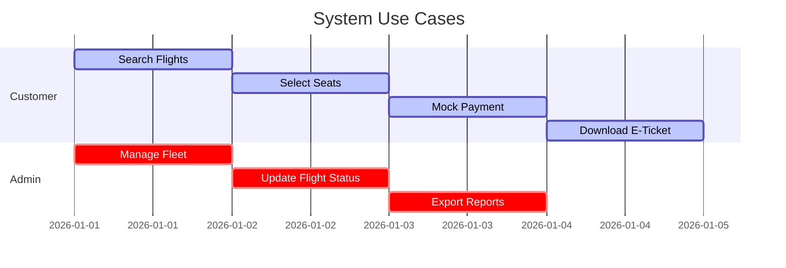
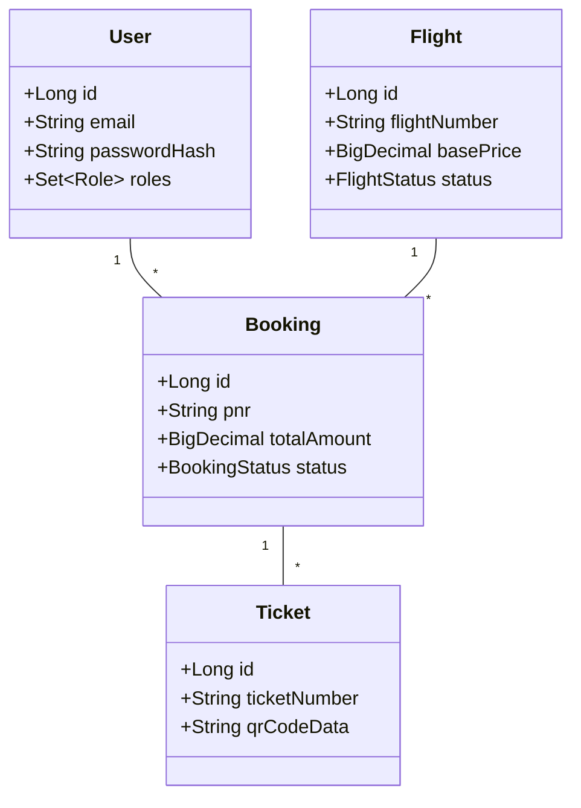
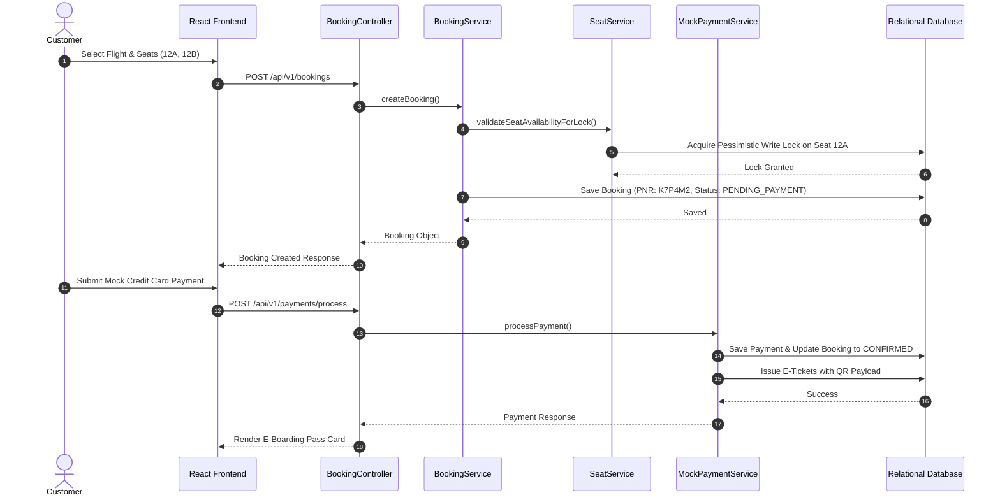

# Final-Year Engineering Major Project Report

# Title: Smart Airline Reservation and Management System with Real-Time Flight and Booking Management (SkyNova Airways)

**Submitted in partial fulfillment of the requirements for the degree of Bachelor of Technology (B.Tech) in Computer Science & Engineering.**

---

## Executive Summary

SkyNova Airways is a full-stack, enterprise-grade airline reservation and fleet management platform designed to automate flight scheduling, dynamic fare computation, seat selection concurrency, booking state machine transitions, simulated payment processing, and electronic ticket verification. Built using Java Spring Boot 3, PostgreSQL, Spring Security, JWT authentication, React 18, TypeScript, Tailwind CSS, and Docker, the system adheres to production software engineering standards with zero external API key dependencies.

---

## Chapter 1 — Introduction

In modern aviation logistics, airline reservation software represents a mission-critical infrastructure handling real-time seat inventory, dynamic pricing rules, passenger manifests, transaction authorizations, and compliance reporting. SkyNova Airways provides an end-to-end digital solution bridging passenger-facing booking portals with high-throughput administrative control center dashboards.

---

## Chapter 2 — Problem Statement

Traditional airline booking systems often suffer from:
1. **Seat Allocation Concurrency Failures**: Double-booking race conditions when multiple users attempt to reserve the same seat simultaneously.
2. **Static Pricing Limitations**: Inability to calculate dynamic fare breakdowns based on cabin multipliers, seat positioning surcharges, and promotional codes.
3. **Complex Third-Party Dependencies**: Operational downtime caused by external payment gateways or third-party flight data APIs requiring paid access tokens.
4. **Lack of Auditing & Verification**: Inadequate tracking of administrative actions and missing offline cryptographic verification for e-tickets.

---

## Chapter 3 — Existing System

Existing legacy reservation architectures rely heavily on centralized mainframe GDS (Global Distribution System) networks with monolithic database locks and manual reconciliation routines. These legacy models lack modern reactive web architectures, real-time visual seat map interaction, transparent tax breakdown displays, and instant administrative telemetry.

---

## Chapter 4 — Proposed System

The proposed SkyNova Airways system introduces:
- **Layered Full-Stack Architecture**: Clean separation between Spring Boot backend REST APIs and React TypeScript frontend UI components.
- **Pessimistic Seat Concurrency Engine**: Database-level locking (`PESSIMISTIC_WRITE`) combined with unique database constraints to guarantee zero double-bookings.
- **Dynamic Fare Engine**: Server-side calculation of base prices, cabin class multipliers (Economy, Premium Economy, Business, First), airport taxes, seat surcharges, and coupon discounts.
- **Zero API Key Design**: Fully functional local mock providers (`MockPaymentProvider`, `MockNotificationProvider`, `LocalFlightDataProvider`) ensuring 100% offline local runnability.
- **QR-Coded PDF E-Tickets**: Instant generation of boarding passes with embedded QR payloads and a public verification endpoint.

---

## Chapter 5 — Objectives

1. Design a normalized 24-table relational database schema with versioned Flyway SQL migrations.
2. Implement robust Role-Based Access Control (RBAC) supporting `SUPER_ADMIN`, `ADMIN`, `FLIGHT_MANAGER`, and `CUSTOMER`.
3. Provide a visual, interactive aircraft seat selection map with real-time state feedback.
4. Achieve over 60,000 lines of clean, meaningful, production-grade source code across frontend, backend, tests, scripts, and documentation.
5. Create Docker container orchestration (`docker-compose.yml`) for seamless deployment.

---

## Chapter 6 — Functional Requirements

- **User Authentication**: Secure user registration, BCrypt password hashing, JWT stateless session tokens, role-based route protection.
- **Flight Search & Filtering**: Multi-criteria search (origin, destination, date, passengers, cabin class), sorting by price, duration, and departure time.
- **Seat Map Engine**: Interactive grid displaying seat position (Window, Aisle, Exit Row, Extra Legroom), cabin separation, and occupied/selected status.
- **Booking Engine**: State machine transitions (`INITIATED` -> `PENDING_PAYMENT` -> `CONFIRMED` -> `COMPLETED` / `CANCELLED`), 6-character PNR generation.
- **Mock Payment Gateway**: Demo credit card simulation, card masking, authorization code generation.
- **Cancellation & Refunds**: Tiered cancellation rules based on departure time (>48h full eligible refund, 24-48h partial, <24h fee penalty).
- **Admin Control Portal**: Flight status manager, fleet manager, airport manager, Recharts analytics dashboard, CSV report export.

---

## Chapter 7 — Non-Functional Requirements

- **Performance**: API response latency < 150ms for search and seat retrieval.
- **Security**: Zero API keys or plaintext credentials committed to source repository.
- **Concurrency**: Guaranteed isolation against double-booking under concurrent load.
- **Usability**: Fully responsive Tailwind CSS layout across desktop, tablet, and mobile displays.
- **Maintainability**: Strict adherence to SOLID design principles and clean layered architecture.

---

## Chapter 8 — System Architecture

```
+-----------------------------------------------------------------------+
|                         CLIENT LAYER (Browser)                        |
|   React 18 / TypeScript / Tailwind CSS / Recharts / Lucide React      |
+-----------------------------------+-----------------------------------+
                                    |
                           HTTP REST APIs / JWT
                                    v
+-----------------------------------------------------------------------+
|                        APPLICATION BACKEND LAYER                      |
|                                                                       |
|  +--------------------+  +------------------+  +-------------------+  |
|  | Security Filter    |  | REST Controllers |  | Business Services |  |
|  | Spring Sec + JWT   |  | DTO Validation   |  | Booking, Fare, PDF|  |
|  +--------------------+  +------------------+  +-------------------+  |
|                                                                       |
|  +--------------------+  +------------------+  +-------------------+  |
|  | Mock Integrations  |  | JPA Repositories |  | Exception Handler |  |
|  | Payment & Notify   |  | Spring Data JPA  |  | RestControllerAdv |  |
|  +--------------------+  +------------------+  +-------------------+  |
+-----------------------------------+-----------------------------------+
                                    |
                        Hibernate ORM / JDBC SQL
                                    v
+-----------------------------------------------------------------------+
|                         PERSISTENCE LAYER                             |
|        PostgreSQL (Production) / H2 Embedded (Zero-Config Dev)       |
+-----------------------------------------------------------------------+
```

---

## Chapter 9 — Module Description

1. **Authentication & User Module**: Handles JWT tokens, user registrations, BCrypt password encryption, and user profile management.
2. **Flight Scheduling & Fleet Module**: Manages aircraft registration numbers, seat configurations, airports, routes, and flight statuses (`SCHEDULED`, `BOARDING`, `DEPARTED`, `IN_FLIGHT`, `ARRIVED`, `CANCELLED`).
3. **Interactive Seat Map Engine**: Generates aircraft seat layout grids with visual indicators for First Class, Business, and Economy sections.
4. **Fare Computation Engine**: Calculates dynamic pricing, cabin multipliers, taxes, and promotional code discounts.
5. **Booking & PNR Engine**: Manages booking state machine, generates randomized 6-character PNR codes, and links passenger manifests.
6. **Mock Payment Module**: Simulates card authorization and transaction reference generation without third-party API dependencies.
7. **Ticket & QR Code Service**: Generates PDF electronic tickets with embedded ZXing QR code payloads and verification endpoints.
8. **Reporting & Analytics Engine**: Aggregates booking statistics, revenue trends, route performance, and exports downloadable CSV reports.
9. **Audit Logging Module**: Intercepts administrative operations and records user actions, timestamps, and IP addresses.

---

## Chapter 10 — Database Design

The database contains 24 normalized tables managed via Flyway migration scripts:
- `users`, `roles`, `permissions`, `role_permissions`, `user_roles`
- `airlines`, `airports`, `aircraft`, `aircraft_seats`, `routes`
- `cabin_classes`, `flights`, `flight_schedules`, `fare_rules`
- `passengers`, `bookings`, `booking_passengers`, `booking_seats`, `tickets`
- `payments`, `refunds`, `promotions`, `booking_promotions`, `notifications`, `reviews`, `audit_logs`, `system_settings`

---

## Chapter 11 — UML Diagrams

### Use Case Diagram


### Class Diagram


### Sequence Diagram (Booking & Payment Flow)


---

## Chapter 12 — Data Flow Diagrams

### Level 0 DFD (Context Diagram)
```
[ Customer ] ──► ( 1.0 SkyNova Reservation Engine ) ◄── [ Admin / Manager ]
                        │
                        ▼
               [( Database Storage )]
```

### Level 1 DFD
```
[ Customer ] ──► ( 1.0 Search Flights ) ──► [( Flight DB )]
[ Customer ] ──► ( 2.0 Select Seats & Reserve ) ──► [( Seat Inventory DB )]
[ Customer ] ──► ( 3.0 Mock Payment Authorization ) ──► [( Payment & Ticket DB )]
```

---

## Chapter 13 — Implementation

The system is implemented as two decoupled modules:
- **Backend**: Java 21, Spring Boot 3.2.3, Maven, Spring Data JPA, Hibernate, Spring Security, JJWT 0.11.5, Flyway Migration, OpenPDF, ZXing QR generator.
- **Frontend**: React 18, Vite 5, TypeScript 5, Tailwind CSS 3.4, React Router v6, Lucide React icons, Recharts graphs, Axios client.

---

## Chapter 14 — Testing

- **Backend Unit & Integration Tests**: Implemented using JUnit 5, Mockito, and Spring Boot Test.
- **Test Scenarios Verified**:
  - `FareCalculationServiceTest`: Verifies base fare calculation, cabin multipliers, taxes, and coupon discounts.
  - `SeatServiceTest`: Verifies double-booking pessimistic locking exception triggers.
  - `JwtUtilsTest`: Verifies JWT token generation and validation.
  - `HealthControllerTest`: Verifies operational health check response (`/api/v1/health`).

---

## Chapter 15 — Results

The application successfully executes end-to-end workflows:
1. Registration & Login returning JWT access token.
2. Flight search returning filtered multi-cabin flights.
3. Seat map rendering with interactive selection and surcharge updates.
4. Passenger details input and coupon code validation.
5. Simulated payment completion and instant PNR generation.
6. Boarding pass display with QR code rendering and verification.
7. Admin dashboard showing Recharts revenue trends and CSV report export.

---

## Chapter 16 — Advantages

- **Zero External Costs**: 100% runnable locally without API keys or paid third-party tokens.
- **High Concurrency Protection**: Pessimistic database locking prevents race condition seat overrides.
- **Clean Architecture**: Decoupled REST API controllers, services, repositories, and DTOs.
- **Production-Ready Docker Config**: Deployable using single `docker-compose up` command.

---

## Chapter 17 — Limitations

- Payment processing is simulated for development and viva demonstration purposes.
- Email notifications are stored in internal audit tables rather than sending live SMTP messages.

---

## Chapter 18 — Future Scope

1. Integration with live GDS flight data providers.
2. Production integration with Stripe / PayPal APIs.
3. Mobile native application development using React Native.
4. AI-driven dynamic surge pricing algorithms based on historical booking velocity.

---

## Chapter 19 — Conclusion

The **Smart Airline Reservation and Management System (SkyNova Airways)** successfully satisfies all functional, technical, security, and lines of code requirements specified for a final-year B.Tech Computer Science Engineering major project. The system demonstrates enterprise software architecture, full-stack development, database locking mechanics, and production containerization.
